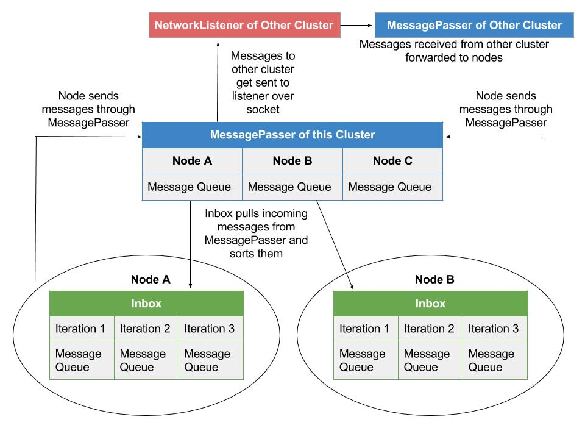
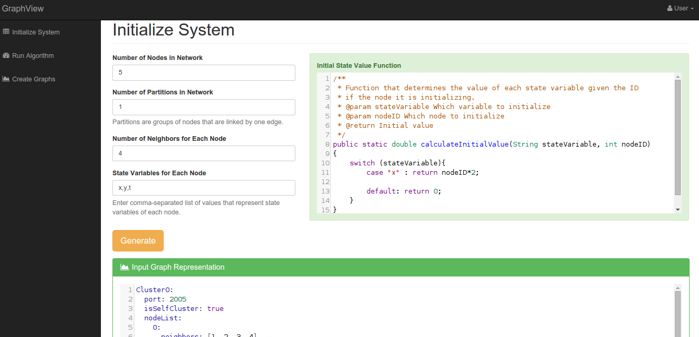
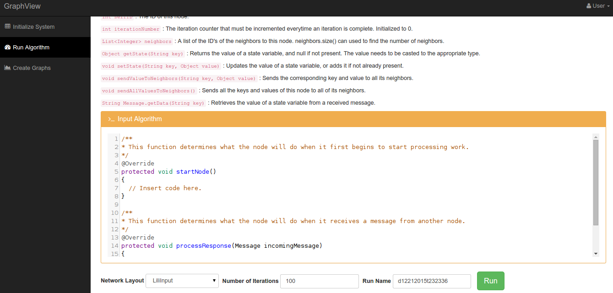
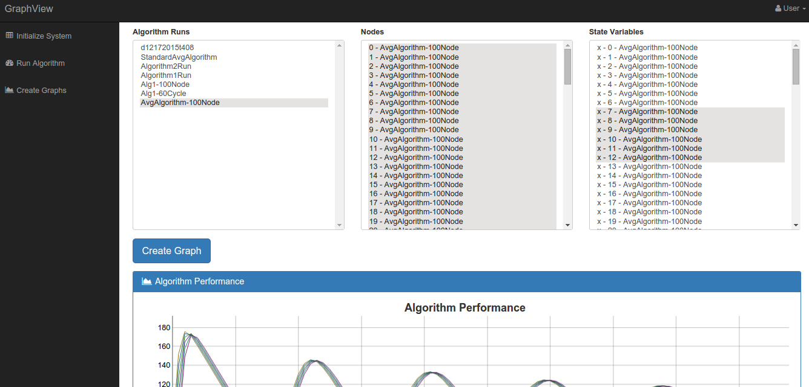
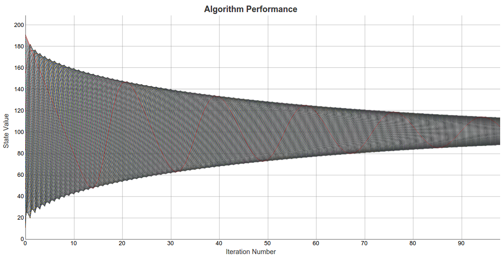
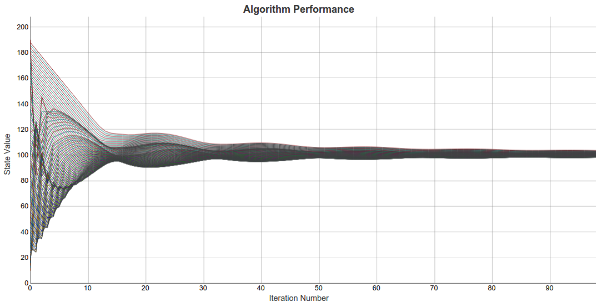

# A Framework for Evaluating Iterative Algorithms on Distributed Systems

## Introduction
In the field of Distributed Systems, different algorithms are developed that determine the behavior of a node - an independent unit that processes work - within a network of nodes. The nodes are only aware of the properties pertaining to itself, and its direct neighbors. Each node has the ability to communicate with its neighbors through some form of message passing system. Iterative algorithms are a class of these algorithms - they consist of blocks of code that are repeatedly executed by several nodes in a network. After multiple iterations, the values of the different nodes will approach consensus. The purpose of this system is to evaluate and study the behavior of these algorithms, such as those described in [\[1\]](#approx-consensus)[\[2\]](#dual-averaging)[\[3\]](#lili1)[\[4\]](#lili2)

When studying these algorithms, a significant amount of time is spent developing the system of nodes and a means for communication between them. Development can become tedious due to the nature of launching and running multiple nodes in parallel. This framework provides a way for the user to simulate and visualize a network of nodes running a given algorithm, while blackboxing the actual implementation of those nodes.

The user provides a few lines of code to be compiled into the Java application that define the behavior of each node. They then create an input file to indicate how these nodes are connected to each other and the nodes' initial values. With the input algorithm and the network representation, the system can run the simulation over a given number of iterations and save those results.

To complement the Java application, an Express.js web application was built to easily run simulations under different conditions and to visualize the resulting data.

## Table of Contents
- [Application Architecture](#application-architecture)
  - [Node](#node)
  - [Network Layout File](#network-layout-file)
  - [Message Passing](#message-passing)
  - [Multi-Cluster Support](#multi-cluster-support)
- [Web App](#web-app)
  - [Initialize System](#initialize-system)
  - [Run Algorithm](#run-algorithm)
  - [Create Graph](#create-graph)
- [Sample Runs](#sample-runs)  
- [Installation and Configuration](#installation-and-configuration)
- [Related Work](#related-work)
- [About](#about)


## Application Architecture
The goal of the system was to simulate a theoretical network of nodes to study how an algorithm behaves, so real-world constraints like network delay and faulty nodes weren't a concern in the initial design. In the interest of speed and minimizing communication overhead, a shared memory approach was chosen to pass messages between the different threads that represented individual nodes.

The system also supports spreading different segments of the network amongst multiple computers, or "clusters", to harness more processing power. The individual nodes have no awareness of which cluster its neighbor is located in, that logic is provided by the message passing data structures. 

### Node
The functionality of an individual node is divided between two classes -  the `GenericNode` class, and its subclass `CustomNode`. The code for a specific algorithm is placed in `CustomNode`, which is required to implement the two abstract methods - `startNode()` and `processResponse()`. To implement an algorithm, its logic must be separated into what to do to start an iteration, `startNode()`, and complete an iteration, `processResponse()`. The user also has access to several helper functions for access the system and the message passer.


> #### Helper Functions
> `int selfID` : The ID of this node.

>`int iterationNumber` : The iteration counter that represents what iteration this node is currently on. Initialized to 1.

>`int iterationMax` : The maximum number of iterations that should be executed.

>`List<Integer> neighbors` : A list of the ID's of the neighbors to this node. neighbors.size() can used to find the number of neighbors.

>`Object getState(String key)` : Returns the value of a state variable, and null if not present. The value needs to be casted to the appropriate type.

>`void setState(String key, Object value)` : Updates the value of a state variable, or adds it if not already present.

>`void sendValueToNeighbors(String key, Object value)` : Sends the corresponding key and value to all its neighbors.

>`void sendAllValuesToNeighbors()` : Sends all the keys and values of this node to all of its neighbors.

> `String Message.getData(String key)` : Returns the value of a given key in a message received from another node.

> `void goToNextIteration()` : Move this node to the next iteration.

> `void printToConsole(String output)` : Prints a given string to the console using a separate helper thread so that the primary thread can continue processing work for the node.


As the system initializes and launches different nodes in the network, they each stand by waiting for a start message from the system coordinator(whose implementation is discussed later). After all the nodes in this cluster and any other cluster defined by the network are started, the coordinator will then send start messages to each node to indicate that they can begin processing work. Upon receiving a message from a start message from the coordinator, the node executes the code in `startResponse()` that will do the work to begin executing the algorithm.

To illustrate a proper implementation of the method, a simple algorithm to calculate the average value of all the nodes in a network is used. The algorithm assumes each node has a different value for `x`, but after several iterations the values for all the nodes will converge to the initial system average. The logic for each node is to calculate the average of all of the neighbors' values and store that as your new value. After running several iterations of this, all the values will represent the system average. This is the pseudocode:

```
while node is running:
    Get all neighbors' value of x
    Calculate the average of the responses and store as new x    
```

For this algorithm, once a node starts, it needs to send all of its values to its neighbors. This can be easily done using the helper functions provided by the framework. Here `startNode()` retrieves the initial value of `x`, and then sends it to its neighbors. A valid implementation would look similar to this:

```java
@Override
protected void startNode() {
    int initialX = getState("x");

    sendValueToNeighbors("x", initialX);
}
```
Now after every node in the network has sent its value to all the other nodes, the system can begin doing work. To complete an iteration, each node has to keep track of all the values it receives from its neighbors. Once it receives all messages from all the neighbors, the average is calculated and stored as the new value for `x`. A proper implementation of `processResponse()` along with some supporting functions follow:

```java
private List<Double> responsesReceived = new ArrayList<>();

private double calculateAverageOfList(List<Double> listOfInts) {
    double sum = 0;

    for(double item : listOfInts) {
        sum += item;
    }

    return sum/listOfInts.size();
}

@Override
protected void processResponse(Message incomingMessage) {
    Double responseValue = Double.parseDouble(incomingMessage.getData("x"));

    responsesReceived.add(responseValue);

    // Once all the neighboring responses are received, average them and update x
    if(responsesReceived.size() >= neighbors.size()){
        double averageOfResponses = calculateAverageOfList(responsesReceived);

        setState("x", averageOfResponses);

        responsesReceived.clear();

        goToNextIteration();

        sendValueToNeighbors("x", averageOfResponses);
    }
}
```

A list is used to store another neighbor's value of `x` everytime a response is received. Once the messages from all the neighbors are received, the node calculates the average and stores that as the new value for `x`. When the work for this iteration is complete, the node needs to once again do the preliminary work to start the next iteration as in `startResponse()`. For this algorithm, the node just needs to send its value of `x` again to all its neighbors. `goToNextIteration()` is called to notify the system that this node is moving to the next iteration.

> NOTE: The algorithm will continue iterating until it has reached the maximum number of iterations that was set, either as a command-line argument or by the webapp. If `goToNextIteration()` isn't called, the node will continue processing work indefinitely since it doesn't know when it's time to stop.

### Network Layout file
The system requires an input file that represents the layout of the network - which nodes are connected to which nodes. This file also holds the all the initial state values of every node. YAML was chosen as the data serialization format for its readability. Here's a valid input file:

```yaml
Cluster0:
  isSelfCluster: true
  ip: localhost
  port: 20005
  nodeList:
    0:
      neighbors: [1,2]
      data:
        x: 2.0
        y: 0.0
        t: 0.0
    1:
      neighbors: [0,2]
      data:
        x: 4.0
        y: 0.0
        t: 0.0
    2:
      neighbors: [0,1]
      data:
        x: 6.0
        y: 0.0
        t: 0.0
```

The network is grouped into different clusters to identify which computer each of the nodes are running on. Every cluster has an `ip` and `port` key to indicate what address it is listening on. It also has a boolean attribute `isSelfCluster` that indicates that this is the cluster that will be represented by the current computer. To launch a multi-clustered network across multiple Java Virtual Machines(the multi-cluster implementation is discussed further below), the user just launches another instance of the Java application with the same input file. The only difference being `isSelfCluster` is set to true for the cluster that that JVM should run.

The `nodeList` consists of a map of all the nodes(by their ID's) to their initial properties. Each node entry has a `neighbors` attribute that represents a list of all the neighbors' ID's, along with a `data` attribute that represents a map of the initial values of that node.

The input YAML file can either be written manually, or generated through the webapp.

### Message Passing
Communication between nodes is accomplished through the `MessagePasser` data structure, which is initialized by the `Launcher` class and passed in to each node before they begin to process work. At it's core, it is simply an array where each entry corresponds to a node in the network. Each entry contains a queue, which will hold all the messages being sent to that particular node.

When the `MessagePasser` receives a message to send, it simply places the message at the end of the appropriate queue for a given node. The function `waitAndRetrieveMessage()` of the `MessagePasser` is used to allow each node to monitor its appropriate queue for incoming messages. The node will process that message using the algorithm given by the user, and then move to the next message in the queue if there is one, otherwise wait for a new message to arrive.

The `MessagePasser`'s array of queues is implemented using Java's `LinkedBlockingQueue`. This queue is classified as thread-safe, so can be added to and read from by multiple nodes without deadlocking. It has a method `take()` that is used to retrieve a message or wait if necessary, without the node having to continuously poll for the status of the queue and waste computational resources.

Despite the safety guaranteed by `LinkedBlockingQueue`, there is still an opportunity to deadlock in the run given certain race conditions. Assume a scenario of a fully connected network using the average consensus algorithm above, where every node in the system is in Iteration 1 and begins to process work. Each node is waiting for a response from its neighbors, and once all the messages are received, that node calculates the average and moves on to Iteration 2 by sending the new value to all its neighbors. Ideally the thread for each node is synchronized with the other threads in the system, and they all move to the next iteration together. But the order and amount of time the processor spends on each thread is a detail beyond the domain of a Java application, and is handled by the Operating System.

Deadlock could arise then if one node moves on to the next iteration ahead of the other, and the messages received by its neighbors span more than one iteration.  Imagine the case where Node A begins Iteration 1 by sending its value to all its neighbors. For clarity in this example, the node IDs will be letters instead of numbers. Node A then waits for its neighbors values, after which Node A will calculate the average and store that as the new value. Once complete, Node A then moves to Iteration 2 by sending out its newest value. Now Node A's neighbor, Node B, is still in Iteration 1 waiting for responses from its various neighbors. Due to the unpredictability of how the OS schedules threads, Node B could receive Node A's message from Iteration 1, and also Iteration 2, before the Iteration 1 messages from all its other neighbors. Processing Node A's Iteration 2 Message while Node B is still in Iteration 1 would make any resulting work done by Node B invalid.

To solve this, each node has a private `Inbox` class that keeps track of all incoming messages. The `Inbox` continuously listens for incoming messages from the `MessagePasser` and sorts the messages by the Iteration they were sent from. It holds the messages in an array of `LinkedBlockingQueue`s similar to the `MessagePasser`, but here each queue corresponds to a different iteration. The size of the array is equal to the maximum number of iterations the algorithm should run, plus one for the start messages received at the beginning of the run. The node will then listen for messages in the queue corresponding the iteration it is currently on, and when it's ready to move to the next iteration it will begin processing messages from the next queue.

A diagram of the network communication structures can be found at the end of the next section on Multi-Cluster support.

### Multi-Cluster Support
As the size of a network grows larger, a single computer would struggle launching and running a large number of nodes in parallel. To address this, the application supports dividing up the network into groups of nodes referred to as "clusters", where each cluster is run on a different instance of the Java Virtual Machine. Each JVM can either be run as different processes on the same computer, or across multiple computers that are networked. The application just needs to know the IP address and Port of the computer that each JVM is on.

The entire application is initialized and started by the `Launcher` class. The `Launcher`'s first tasks are to read the input YAML file, and build the nodes located in the local cluster. After all the nodes have been created, the `Launcher` then sends messages to the JVM's running other clusters indicating that it is ready to process work. Once Ready messages are received from all the clusters specified in the input file, the `Launcher` sends Start messages to all the local nodes to signal that they can run the algorithm.

An individual node is not aware whether its neighbors are in a local cluster or an external cluster. That is handled by the `MessagePasser`, which keeps track of which cluster each node belongs to when the `MessagePasser` is built. When a node attempts to send a message to a node on a another cluster, the `MessagePasser` forwards it to that cluster over a socket to the appropriate address. Each cluster has a `NetworkListener` thread started by the `Launcher` that receives all the messages from external clusters, and then uses the local `MessagePasser` to route it to the appropriate node's queue.  



## Web App
The Express.js web app simplifies the use of the Java application by creating a front end for configuring and launching the system. It provides the ability to create input YAML files for a network of nodes, which can then be used to run a user-inputed algorithm for a set number of iterations. Once the run is complete, a separate view handles creating graphs of different nodes from different runs to help compare the performance of various algorithms.

### Initialize System
The "Initialize System" view handles generating a customizing an input file for a large variety of graphs. After parsing through a certain set of parameters, it will compile the `InputGenerator` tool from the main Java application which then generates a network layout file that is sent to the client browser.



The generator uses 5 parameters to build the input file, the first being the number of nodes in the network. The second parameter specifies the number of "partitions" - distinct groups of nodes that are linked to each other by one edge. The third parameter indicates the number of neighbors each node should have. In the case of a cycle, each node would only have 2 neighbors. For a fully connected graph, each node would have *n - 1* neighbors where *n* is the number of nodes in the graph. The fourth parameter takes in a comma-separated list of names that declare the state variables of each node. The very last parameter is the function `calculateInitialValue()`, which needs to be implemented by the user to initialize the state variables for each node. The function is called on every node for every state value it holds, and based on the switch statement determines a value for that state variable.

> NOTE: To be valid, the number of neighbors for each node has to be less than *n-1* where *n* is the number of nodes in the network, or if there is more than one partition, the number of nodes in the partition.

After clicking __Generate__, a request is sent to the server to build and run the `InputGenerator`. Once the input file is created, the client has the opportunity to further customize it by editing the YAML file in the browser. Once it is edited, it is saved to the database with the specified name after clicking __Save__.

### Run Algorithm
The "Run Algorithm" view is where the user specifies the conditions for a new run and then launches the system.



The page has a quick reference to the helper functions provided by the framework to utilize the system. The Input Algorithm box contains template code for the 2 functions, `startNode()` and `processResponse()`, that the user needs to implement in order to run the system. After inputing the algorithm, the user then specifies additional parameters for the system - which input file to use(generated from the previous view), how many iterations to run, and what name the run should be saved under in the database.

Upon clicking __Run__, the input algorithm and parameters are sent to the server which will then attempt to run the algorithm. The server first replaces the `CustomNode.java` file with the user's new algorithm, and then launches the shell script that builds and runs the system. Upon successful compilation, the Java application will run the algorithm and save the results to the database, then send the algorithm log to view on the client. In the case where there's an error in the user-inputted algorithm and compilation fails, those errors are sent to the client to indicate which line the error occurred.

### Create Graphs
The graphing module allows the user to compare the values of different nodes from different algorithm runs over all the iterations of the run.



The multi-select boxes allow standard selecting of entries with  the *CTRL* and *SHIFT* keys. Holding down *CTRL* and clicking different entries will allow you to select individual entries. Also holding down *CTRL* while dragging your cursor over entries will select all those entries. Holding down *SHIFT* will allow you to select a range of entries between two selected entries.

Every time a selection is made from on of the select boxes, a request is sent to the server to pull the appropriate entries from the database for the next select box. After selecting which runs to graph from the *Algorithm Runs* box, the *Nodes* box is populated with all the nodes from those runs. Once which nodes to graph are selected, the final *State Variables* box is populated with the state variables that each node holds. Upon selecting which state variables to graph and clicking __Create Graph__, the client sends the server all of the parameters needed to retrieve the appropriate data. The server then runs a SQL query to pull the run results, transforms it into a form that can be processed by the DyGraphs charting library, and sends it to the client.

DyGraphs will then graph a line for each state variable of a node that it receives. DyGraphs was chosen for its ability to chart extremely large datasets quickly and efficiently. Once the graph is generated, the user can click and drag a section on the graph to zoom in, as well as hold down *SHIFT* to pan the graph left and right. Double clicking will reset the zoom of the graph.

## Sample Runs
The primary goal of this system is to easily compare and study the performance of different algorithms in various network configurations. To illustrate this, consider a network of 100 nodes where each each node has a state variable `x`. Node 0 is initialized with a value of 2, and every node after that has a value of 2 more than the previous node. Node 99 will then end with a value of 200. Below is a graph, generated by the web app, of the average consensus algorithm run for 100 iterations on the described network.



The graph consists of a 100 lines, each line representing the value of `x` for a particular node. It shows the nodes progressing towards consensus as the iterations complete.

Now consider another average consensus algorithm from Lili Su's paper(reference below). This algorithm slightly differs from the standard algorithm in the way it calculates the new value for `x` after receiving all the neighbors' responses. Here's the algorithm run over a 100 iterations on the same network described before.



The values here behave quite differently, and reach consensus significantly quicker than the previous algorithm. The differences between the two can be better highlighted by graphing a subset of the network from both algorithm runs on the same graph.


Graphing Nodes 0-9 of both runs, it can be easily seen that the algorithm from Lili's paper will reach consensus much earlier than the standard averaging algorithm. The standard algorithm's values also appear to oscillate with a greater magnitude than Lili's algorithm.

> NOTE: In the web app, the values of different nodes at different iterations can be seen by hovering the cursor over those points.

The ability to quickly test different algorithms under different conditions on the same system is a valuable tool to study their performances and relationships. This system allows users to avoid the difficulties that arise with simulating a network of nodes and facilitating communication between them. Graphing these results also provides a way to easily visualize the overall trends of an algorithm along with any subtle behaviors that would be hard to detect from simple console outputs.

## Installation and Configuration
The Java Application and Express Web App were both developed and tested in Ubuntu 12.04, but should be easily portable to other operating systems. The source code for the projects are here:
- Java Application - https://www.github.com/speter52/GraphSim
- Express Web App - https://www.github.com/speter52/GraphView

Both projects require a MySQL instance, and the credentials for a user that has access to the database that will be used by the projects. 

### Java Application
The Java application requires the following dependencies in order to run:
- Java - To compile and run the application.
- Ant - To build the project with the required files.

The application also needs two more jar files - a YAML parsing library and a Java-MySQL connector - both of which are in the git repository. The parameters to connect to the MySQL instance are set in the `config.yml` file located in the root folder of the project.

```yaml
mysql_database : jdbc:mysql://localhost:3306/GraphSim
database_user : java
database_password : password
```
The proper login credentials need to be set here, along with the IP information for the MySQL instance. The name of the database to be used should be appended to the `mysql_database` string.

There is a shell script, `build_and_run.sh`, located in the root folder that will compile all the code and start the system with the given command line arguments. The first argument is the path to the input YAML file, and the second argument will specify the number of iterations the system should run. Sample input files, as well as algorithms, can be found in *GraphInputs*. The following command will run the system with some sample data.

```
./build_and_run.sh GraphInputs/OneCluster.yml 100
```

The Java application also comes with a tool, `InputGenerator`, to automatically generate different input files. This is the tool that the web app retrieves parameters for and creates input files with. The first three arguments for the tool match the parameters from the *Initialize System* tab - number of nodes, number of partitions, and number of neighbors for each node. After these, the tool accepts any number of arguments that represent the different state variables each node will have. The function `calculateInitialValue()` in `NodeDataGenerator.java` determines what value each state variable is initialized to. The following shell script from the root folder can be used to run the `InputGenerator`:

```
./run_input_generator 10 1 9 x y t
```

### Express Web App
The web app requires Node.js, and NPM, Node's package installer. The app also depends on several other packages, but these can be automatically installed navigating to the root folder and running:

```
npm install
```

This will read through the `package.json` file and install all the dependencies required by the server-side code in the folder `node_modules/`. It will then use another dependency manager, Bower, to install all the client-side dependencies in `client/assets/bower_components/`.

> NOTE: Ubuntu has a known issue where a legacy binary is also named `node`, and conflicts with the executable for Node.js. This needs to be resolved before proceeding.  

The web app also needs the proper credentials to connect to the same MySQL instance as the Java application. This can be set in `server/config/database-info.js`:

```javascript
var mysql = require('mysql');

var connection = mysql.createConnection({
  host: '127.0.0.1',
  user: 'java',
  password: 'password',
  database: 'GraphSim',
  multipleStatements: true
});

module.exports = connection;
```

The final step is to let the web app know where the Java application is located. This is set in `server/config/core-info.js`:
```javascript
var pathToCore = '../../../Data/CS/cs499-Thesis/GraphSim/';

module.exports = pathToCore;
```
`pathToCore` should specify the location of the root folder of the Java application in the filesystem.

Once all of the app is properly configured, launch the web server by running

```
npm start
```

and then navigating to ```localhost:3000```.

## Related Work
- <a name="approx-consensus"></a>Bernadette Charron-Bost, Matthias Függer, Thomas Nowak. *Approximate Consensus in Highly Dynamic Networks: The Role of Averaging Algorithms*, arXiv:1408.0620.
- <a name="dual-averaging"></a>John Duchi, Alekh Agarwal, Martin Wainwright. *Dual Averaging for Distributed Optimization: Convergence Analysis and Network Scaling*,  	arXiv:1005.2012.
- <a name="lili1"></a>Lili Su, Nitin Vaidya. *Fault-Tolerant Multi-Agent Optimization: Part III*, arXiv:1509.01864.
- <a name="lili2"></a>Lili Su, Nitin H. Vaidya. *Fault-Tolerant Distributed Optimization (Part IV): Constrained Optimization with Arbitrary Directed Networks*,  	arXiv:1511.01821.

## About
This project was my Senior Thesis during the Fall of 2015 under Professor Nitin Vaidya(University of Illinois at Urbana-Champaign). For questions or comments, email Simon Peter - speter3@illinois.edu.
